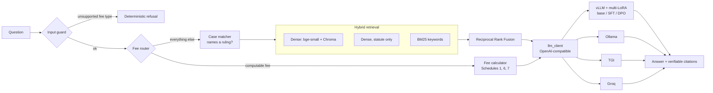

# Advocate Remuneration Assistant

A retrieval-augmented assistant for Kenyan advocates' fees. It answers questions about the Advocates (Remuneration) Order and Kenyan case law on taxation of costs, and computes fees and full bills of costs exactly, using a deterministic calculator rather than the language model's arithmetic. It runs on a hosted API or on a **self-hosted stack** (vLLM, a QLoRA fine-tune and on-policy DPO) behind one env-var switch.

**Live demo:** https://advocate-renumeration-assistant.streamlit.app/  ·  **Fine-tuned adapter:** https://huggingface.co/mikekeror/qwen2.5-7b-advocate-dpo-lora  ·  **Full documentation:** [docs/DOCUMENTATION.md](docs/DOCUMENTATION.md)

> Not legal advice. Figures are computed from the Order as revised to 2022 and may not reflect later amendments or a taxing officer's discretion.

## TL;DR

- Pipeline engineering (retrieval fixes, a deterministic fee calculator, an input guard) drove most of the accuracy gains.
- QLoRA SFT eliminated fabricated citations (11 to 0) at parity or better on correctness.
- On-policy DPO (81 pairs mined from the SFT model's own mistakes) reached 92% preference accuracy on held-out pairs and gave the best case attribution, but no measurable correctness gain at n=62.
- The remaining errors are dominated by retrieval misses shared by every model.
- One RTX 4090 serves about 8 concurrent users on this workload, with 2-7% LoRA overhead.

## What it does

- **Answers legal questions with citations.** Every claim cites the exact chunk and case it came from, and the assistant says "Not covered in the provided documents" rather than guessing.
- **Calculates fees exactly.** Questions like "What is the discharge fee for a charge over a Kshs 2,800,000 loan?" are routed to a deterministic calculator (Kshs 15,000), and the model is told to state that figure, not recompute it. Unsupported fee types are refused by an input guard instead of guessed.
- **Builds full bills of costs.** A form produces an itemised High Court bill (Schedule 6), separating professional fees from disbursements, citing the Order's provision for every line, and adding VAT.
- **Shows its own evaluation.** An in-app tab compares base, SFT and DPO results from the evaluation harness.

## How it works



- **Ingestion:** 210 PDFs (the Order plus ~209 Kenya Law rulings) are cleaned, split by section, chunked and tagged with case metadata; the Order's fee tables are extracted separately.
- **Retrieval:** dense search (BAAI/bge-small-en-v1.5 + ChromaDB), a statute-only dense search and BM25 are fused with Reciprocal Rank Fusion. When a question names a ruling, retrieval is scoped to that ruling and its chunks are pinned first. The dense component follows the dense passage retrieval approach of Karpukhin et al. (2020); see the [documentation](docs/DOCUMENTATION.md) for what was and wasn't replicated.
- **Calculation:** a regex router detects computable fee questions and sends them to the fee calculator.
- **Generation:** `llm_client.py` points the same pipeline at Groq, vLLM, Ollama or TGI by changing `LLM_BASE_URL`, `LLM_API_KEY` and `LLM_MODEL`.

## Serving

| Backend | Model | Notes |
|---|---|---|
| vLLM | Qwen2.5-7B-Instruct-AWQ | TTFT 58 ms, ~171 tok/s single stream, short prompt |
| vLLM (multi-LoRA) | Qwen2.5-7B-Instruct + 3 adapters | Base and adapters served side by side from one process |
| Ollama | qwen2.5:7b-instruct-q4_K_M | 8k context, model kept resident |
| TGI | Qwen2.5-7B-Instruct | Separate pod |
| Groq | gpt-oss-20b | Hosted baseline used by the live demo |

## Post-training

**Data:** 550 synthetic examples (300 grounded/ruling, 100 grounded/statute, 60 calculator, 60 refusal, 30 off-scope), generated by gpt-oss-20b run locally. The teacher never writes citations; a script inserts them, so citation format is verifiable. The train/val split is grouped by case, and every eval case, passage, question and amount is excluded from training.

**SFT:** QLoRA (4-bit NF4), LoRA r=16 on all linear layers, 40.4M trainable parameters (0.53%), completion-only loss. 2 epochs on one RTX 4090 in 42.7 minutes (about $0.55). Validation loss was lowest after epoch 1 (0.198 vs 0.206), so epoch 1 was kept.

**DPO:** On-policy. The SFT model answered 448 training prompts; failures (wrong answer or missing source citation) became rejected samples and the gold answer the chosen sample, giving 81 pairs. The reference model is the SFT adapter, with log-probs computed once up front. beta=0.1, LR 2e-5, 2 epochs, NLL regulariser 0.2. Validation preference accuracy rose from 0 to 0.917.

## Evaluation

The harness measures exact numeric correctness, retrieval hits, calculator routing, citation verifiability (does every cited chunk exist in what was retrieved?), whether the answer cites the case it was asked about, and LLM-judged faithfulness. Factual answers are judged against a reference answer.

Two question sets: 24 original questions, and 62 questions including 33 held-out ones and three hand-written hard cases.

| 62-question set | Base | SFT | SFT + DPO |
|---|---|---|---|
| Correctness | 85.5% | 87.1% | 87.1% |
| Fabricated citations | 11 | 0 | 0 |
| Cites the case asked about | 87.2% | 89.7% | 92.3% |
| Faithfulness (1-5) | 4.80 | 4.69 | 4.64 |

On the original 24 questions, base and SFT both score 100% correct, but base fabricates 4 citations and SFT none. At n=62 the correctness differences are within noise; the fabricated-citation drop is the clear effect. Faithfulness dipped slightly for the adapters, which over-compress a few answers. Five questions fail for every model because retrieval never surfaces the right passage.

Evaluation runs surfaced a real bug each time, from silent context truncation (68% of chunks were cut at 1,000 characters) to fabricated citations and a contaminated training example; the [documentation](docs/DOCUMENTATION.md) lists them.

## Load benchmark

RTX 4090, ~3,500-token prompts, 256-token answers. Every request uses a unique prompt: an early run reused prompts and prefix caching made TTFT look like 85 ms at 8 users.

| Users | Model | TTFT p50 / p95 | tok/s per request | Aggregate tok/s |
|---|---|---|---|---|
| 1 | base | 301 ms / 398 ms | 62.6 | 58 |
| 1 | LoRA | 324 ms / 433 ms | 58.4 | 55 |
| 8 | base | 976 ms / 2.4 s | 43.1 | 294 |
| 8 | LoRA | 1.19 s / 1.93 s | 42.8 | 288 |
| 32 | base | 4.8 s / 14.9 s | 22.2 | 437 |
| 32 | LoRA | 5.2 s / 15.8 s | 21.0 | 410 |

LoRA adds 2-7% overhead. Beyond about 8 concurrent users, latency degrades faster than throughput improves.

## Quickstart

```bash
git clone https://github.com/mikekeror-rgb/advocate_renumeration_assistant_v1.git
cd advocate_renumeration_assistant_v1
python -m venv .venv && source .venv/bin/activate
pip install -r requirements.txt
cp .env.example .env                 # add GROQ_API_KEY (free key at console.groq.com)

streamlit run app.py                 # the app
python rag_pipeline_v2.py            # command-line Q&A
python eval/eval.py                  # re-run the evaluation
```

To rebuild the index from new PDFs in `data/raw/`: `python chunk.py && python embed_index.py`.

**Docker (Groq backend):**
```bash
docker compose up --build            # http://localhost:8501
```
Image size: 3.41 GB on disk (806 MB compressed), CPU-only PyTorch, embedding model baked in.

**Self-hosted GPU stack (vLLM + DPO adapter):**
```bash
docker compose --profile gpu up --build   # app on :8502
```
Requires an NVIDIA GPU and the adapter in `./adapters` (or download it from the Hugging Face link above).

**Tests:** `pip install -r requirements-dev.txt && pytest -q`. CI runs lint, unit tests and a Docker build plus compose validation on every push.

## Repository map

| Path | What it holds |
|---|---|
| `app.py` | Streamlit app (Q&A, bill of costs, evaluation tab) |
| `rag_pipeline_v2.py` | Retrieval, prompt building, generation |
| `fee_router.py`, `case_matcher.py` | Calculator routing, input guard, case-scoped retrieval |
| `llm_client.py` | Backend switch |
| `training/` | Data builder, QLoRA SFT, DPO pair mining, DPO trainer |
| `eval/` | Eval harness, question sets, results CSVs |
| `scripts/`, `bench.py` | vLLM, Ollama and TGI serving scripts, load benchmark |
| `tests/` | Calculator, matcher, eval-check and benchmark tests |

## Tech stack

Python · pdfplumber · sentence-transformers (bge-small-en-v1.5) · ChromaDB · rank-bm25 · vLLM · Ollama · TGI · PEFT / TRL-style QLoRA and DPO · Groq · Streamlit · Docker · GitHub Actions

## Limitations

- Eval sets are small; differences of a few points are not significant.
- Training data is synthetic, written by a 20B teacher and filtered by rules, not reviewed by a lawyer.
- This is a research prototype, not legal advice.

## Related work

- [hybrid-retrieval-eval](https://github.com/mikekeror-rgb/hybrid-retrieval-eval): this project's hybrid retrieval, extracted into a reusable ZenML pipeline and proposed to ZenML's rag-recipes (issue #2).
- DeepEval PR #3375: fix for misleading "invalid JSON" errors from reasoning-model judges, found through this project's own empty-output bug.
- DeepEval issue #3376: proposed catching fabricated `[N]` citations deterministically; implemented by another contributor in PR #3378.

## Author

Mike Keror · [GitHub](https://github.com/mikekeror-rgb)
